# Qurban Database ERD

## Scope and evidence

This is the proposed transactional model for the current Qurban product scope.
The repository currently has no applied business tables, ORM models, or
business queries. The four numbered migration pairs and explicit seed runner
now exist, but no migration has been applied to staging or production. Every
business table below is therefore classified as `NEW`; there are no `EXISTING`
or `CHANGE` tables. The `schema_migrations` and `schema_seeds` lifecycle tables
are tool metadata and are intentionally outside this business ERD.

The model is grounded in:

- `docs/PRD.md` for actors, channel flows, lifecycle requirements, and open product decisions;
- `docs/PRODUCT_MAP.md` for capability ownership and roadmap scope;
- `docs/ARCHITECTURE.md` and `docs/DECISIONS.md` for PostgreSQL, event isolation, UUIDs, ledgers, audit, outbox, and concurrency requirements;
- the Go API and Compose configuration for the verified PostgreSQL runtime.

## Repository conventions discovered

| Concern                    | Discovered convention or proposed baseline                                                                                                                                                                                               |
| -------------------------- | ---------------------------------------------------------------------------------------------------------------------------------------------------------------------------------------------------------------------------------------- |
| Database                   | PostgreSQL 18 in `infrastructure/compose.yaml`; Go uses `pgx/v5` through `database/sql`.                                                                                                                                                 |
| Migration framework        | `golang-migrate/migrate/v4` consumes numbered standalone SQL pairs through `apps/api/cmd/db`; API startup remains migration-free.                                                                                                        |
| Schema                     | PostgreSQL `public` schema; no existing schema convention to preserve.                                                                                                                                                                   |
| Naming                     | Lowercase plural `snake_case` table names and lowercase `snake_case` columns.                                                                                                                                                            |
| Primary keys               | UUID primary keys with PostgreSQL `gen_random_uuid()` defaults. This is a proposed baseline, not an existing convention.                                                                                                                 |
| Public/business references | Human-readable unique references are used where operators or participants need lookup (`purchase_ref`, `account_ref`, and similar). UUIDs remain the stable API identifiers.                                                             |
| Foreign keys               | Explicit foreign keys. Event-scoped child references carry `event_id`; composite foreign keys are used where the relationship must remain within the same event.                                                                         |
| Time                       | `timestamptz` values, stored in UTC by PostgreSQL/application convention. Dates that have no time-of-day are deferred to the owning workflow.                                                                                            |
| Timestamps                 | Mutable aggregates use `created_at` and `updated_at`. Append-only history, ledger, audit, outbox, and idempotency records use immutable timestamps and no `updated_at`. No trigger convention exists; the application owns `updated_at`. |
| Statuses                   | `text` plus table-local `CHECK` constraints instead of PostgreSQL enums, so lifecycle vocabulary can evolve without enum migrations.                                                                                                     |
| Money                      | Signedness is represented by `direction`; amounts are positive `bigint` minor units plus a three-letter uppercase `currency_code`. Floating point is not used.                                                                           |
| Quantities                 | Livestock weight uses `numeric(10,3)` kilograms. Other quantities remain deferred until entitlement/package rules are confirmed.                                                                                                         |
| Soft deletion              | No `deleted_at` is added. Statuses, cancellation fields, and append-only history preserve business history; physical deletion is restricted by foreign keys.                                                                             |

## Mermaid ERD

```mermaid
erDiagram
    OPERATOR_USERS {
        uuid id PK
        text external_subject UK
        text display_name
        text status
        timestamptz created_at
        timestamptz updated_at
    }

    PARTIES {
        uuid id PK
        text party_type
        text display_name
        text email
        text phone
        timestamptz created_at
        timestamptz updated_at
    }

    QURBAN_EVENTS {
        uuid id PK
        smallint event_year UK
        text name
        text status
        timestamptz registration_opens_at
        timestamptz registration_closes_at
        bigint participant_quota
        timestamptz created_at
        timestamptz updated_at
    }

    EVENT_LOCATIONS {
        uuid id PK
        uuid event_id FK
        text code
        text name
        text location_type
        timestamptz created_at
        timestamptz updated_at
    }

    OFFERINGS {
        uuid id PK
        uuid event_id FK
        text code
        text name
        text offering_kind
        bigint price_minor
        text currency_code
        integer participant_capacity
        text status
        timestamptz created_at
        timestamptz updated_at
    }

    SAVING_ACCOUNTS {
        uuid id PK
        uuid event_id FK
        uuid holder_party_id FK
        uuid target_offering_id FK
        bigint target_amount_minor
        text currency_code
        text status
        bigint version
        timestamptz created_at
        timestamptz updated_at
    }

    GIVEAWAY_PROGRAMS {
        uuid id PK
        uuid event_id FK
        uuid sponsor_party_id FK
        text code
        text status
        bigint funding_limit_minor
        text currency_code
        timestamptz created_at
        timestamptz updated_at
    }

    GIVEAWAY_APPLICATIONS {
        uuid id PK
        uuid program_id FK
        uuid applicant_party_id FK
        uuid nominee_party_id FK
        text status
        uuid reviewed_by_operator_id FK
        timestamptz created_at
        timestamptz updated_at
    }

    GIVEAWAY_ASSIGNMENTS {
        uuid id PK
        uuid event_id FK
        uuid program_id FK
        uuid application_id FK
        uuid recipient_party_id FK
        text status
        uuid assigned_by_operator_id FK
        timestamptz created_at
        timestamptz updated_at
    }

    PURCHASES {
        uuid id PK
        uuid event_id FK
        text purchase_ref UK
        text channel
        uuid purchaser_party_id FK
        uuid payer_party_id FK
        uuid offering_id FK
        uuid saving_account_id FK
        uuid giveaway_assignment_id FK
        bigint total_amount_minor
        text currency_code
        text status
        bigint version
        timestamptz created_at
        timestamptz updated_at
    }

    PURCHASE_STATUS_HISTORY {
        uuid id PK
        uuid purchase_id FK
        text from_status
        text to_status
        uuid changed_by_operator_id FK
        timestamptz changed_at
    }

    SOHIBUL_QURBAN {
        uuid id PK
        uuid event_id FK
        uuid purchase_id FK
        uuid party_id FK
        text participant_ref UK
        text display_name_snapshot
        integer sequence_no
        text status
        timestamptz created_at
        timestamptz updated_at
    }

    SOHIBUL_QURBAN_STATUS_HISTORY {
        uuid id PK
        uuid sohibul_qurban_id FK
        text from_status
        text to_status
        uuid changed_by_operator_id FK
        timestamptz changed_at
    }

    PAYMENT_RECORDS {
        uuid id PK
        uuid event_id FK
        text payment_ref UK
        uuid payer_party_id FK
        uuid purchase_id FK
        uuid saving_account_id FK
        uuid giveaway_program_id FK
        bigint amount_minor
        text currency_code
        text method
        text status
        text provider_reference UK
        uuid verified_by_operator_id FK
        timestamptz created_at
        timestamptz updated_at
    }

    PAYMENT_STATUS_HISTORY {
        uuid id PK
        uuid payment_id FK
        text from_status
        text to_status
        uuid changed_by_operator_id FK
        timestamptz changed_at
    }

    FINANCIAL_LEDGER_ENTRIES {
        uuid id PK
        uuid event_id FK
        text entry_type
        text direction
        bigint amount_minor
        text currency_code
        uuid purchase_id FK
        uuid saving_account_id FK
        uuid giveaway_program_id FK
        uuid payment_id FK
        text idempotency_key UK
        timestamptz occurred_at
        timestamptz created_at
    }

    LIVESTOCK {
        uuid id PK
        uuid event_id FK
        uuid location_id FK
        text livestock_code
        text tag_code
        text species
        text category
        numeric weight_kg
        text status
        bigint version
        timestamptz created_at
        timestamptz updated_at
    }

    LIVESTOCK_INSPECTIONS {
        uuid id PK
        uuid event_id FK
        uuid livestock_id FK
        text result
        text notes
        uuid inspected_by_operator_id FK
        timestamptz inspected_at
        timestamptz created_at
    }

    LIVESTOCK_STATUS_HISTORY {
        uuid id PK
        uuid event_id FK
        uuid livestock_id FK
        text from_status
        text to_status
        uuid changed_by_operator_id FK
        timestamptz changed_at
    }

    LIVESTOCK_LOCATION_HISTORY {
        uuid id PK
        uuid event_id FK
        uuid livestock_id FK
        uuid location_id FK
        uuid assigned_by_operator_id FK
        timestamptz assigned_at
        timestamptz released_at
    }

    ALLOCATIONS {
        uuid id PK
        uuid event_id FK
        uuid livestock_id FK
        uuid purchase_id FK
        uuid sohibul_qurban_id FK
        text allocation_ref UK
        integer capacity_units
        text status
        bigint version
        timestamptz created_at
        timestamptz updated_at
    }

    ALLOCATION_STATUS_HISTORY {
        uuid id PK
        uuid allocation_id FK
        text from_status
        text to_status
        uuid changed_by_operator_id FK
        timestamptz changed_at
    }

    SLAUGHTER_SESSIONS {
        uuid id PK
        uuid event_id FK
        text session_ref UK
        timestamptz scheduled_start_at
        timestamptz scheduled_end_at
        text status
        timestamptz created_at
        timestamptz updated_at
    }

    SLAUGHTER_STATIONS {
        uuid id PK
        uuid event_id FK
        uuid session_id FK
        text code
        text name
        timestamptz created_at
        timestamptz updated_at
    }

    SLAUGHTER_RECORDS {
        uuid id PK
        uuid event_id FK
        uuid session_id FK
        uuid livestock_id FK
        uuid allocation_id FK
        uuid station_id FK
        integer queue_position
        text status
        uuid recorded_by_operator_id FK
        bigint version
        timestamptz created_at
        timestamptz updated_at
    }

    DISTRIBUTION_RECORDS {
        uuid id PK
        uuid event_id FK
        uuid purchase_id FK
        uuid sohibul_qurban_id FK
        text distribution_ref UK
        text method
        text status
        timestamptz prepared_at
        timestamptz completed_at
        timestamptz created_at
        timestamptz updated_at
    }

    DISTRIBUTION_STATUS_HISTORY {
        uuid id PK
        uuid distribution_id FK
        text from_status
        text to_status
        uuid changed_by_operator_id FK
        timestamptz changed_at
    }

    AUDIT_LOG {
        uuid id PK
        uuid actor_operator_id FK
        uuid actor_party_id FK
        text actor_reference
        text action
        text target_type
        uuid target_id
        text request_id
        jsonb before_data
        jsonb after_data
        timestamptz created_at
    }

    OUTBOX_EVENTS {
        uuid id PK
        text aggregate_type
        uuid aggregate_id
        text event_type
        jsonb payload
        timestamptz occurred_at
        timestamptz published_at
        integer attempt_count
        timestamptz created_at
    }

    IDEMPOTENCY_RECORDS {
        text namespace PK
        text idempotency_key PK
        text request_hash
        integer response_status
        jsonb response_body
        timestamptz expires_at
        timestamptz created_at
    }

    OPERATOR_USERS ||--o{ PURCHASE_STATUS_HISTORY : changes
    OPERATOR_USERS ||--o{ SOHIBUL_QURBAN_STATUS_HISTORY : changes
    OPERATOR_USERS ||--o{ PAYMENT_RECORDS : verifies
    OPERATOR_USERS ||--o{ PAYMENT_STATUS_HISTORY : changes
    OPERATOR_USERS ||--o{ GIVEAWAY_APPLICATIONS : reviews
    OPERATOR_USERS ||--o{ GIVEAWAY_ASSIGNMENTS : assigns
    OPERATOR_USERS ||--o{ LIVESTOCK_INSPECTIONS : inspects
    OPERATOR_USERS ||--o{ LIVESTOCK_STATUS_HISTORY : changes
    OPERATOR_USERS ||--o{ LIVESTOCK_LOCATION_HISTORY : assigns
    OPERATOR_USERS ||--o{ ALLOCATION_STATUS_HISTORY : changes
    OPERATOR_USERS ||--o{ SLAUGHTER_RECORDS : records
    OPERATOR_USERS ||--o{ DISTRIBUTION_STATUS_HISTORY : changes
    OPERATOR_USERS ||--o{ AUDIT_LOG : acts

    PARTIES ||--o{ PURCHASES : purchases
    PARTIES ||--o{ PURCHASES : pays
    PARTIES ||--o{ SAVING_ACCOUNTS : holds
    PARTIES ||--o{ GIVEAWAY_PROGRAMS : sponsors
    PARTIES ||--o{ GIVEAWAY_APPLICATIONS : applies
    PARTIES ||--o{ GIVEAWAY_APPLICATIONS : nominates
    PARTIES ||--o{ GIVEAWAY_ASSIGNMENTS : receives
    PARTIES ||--o{ SOHIBUL_QURBAN : represents
    PARTIES ||--o{ PAYMENT_RECORDS : pays
    PARTIES ||--o{ AUDIT_LOG : acts

    QURBAN_EVENTS ||--o{ EVENT_LOCATIONS : contains
    QURBAN_EVENTS ||--o{ OFFERINGS : publishes
    QURBAN_EVENTS ||--o{ SAVING_ACCOUNTS : scopes
    QURBAN_EVENTS ||--o{ GIVEAWAY_PROGRAMS : scopes
    QURBAN_EVENTS ||--o{ GIVEAWAY_ASSIGNMENTS : scopes
    QURBAN_EVENTS ||--o{ PURCHASES : contains
    QURBAN_EVENTS ||--o{ SOHIBUL_QURBAN : contains
    QURBAN_EVENTS ||--o{ PAYMENT_RECORDS : contains
    QURBAN_EVENTS ||--o{ FINANCIAL_LEDGER_ENTRIES : contains
    QURBAN_EVENTS ||--o{ LIVESTOCK : contains
    QURBAN_EVENTS ||--o{ ALLOCATIONS : contains
    QURBAN_EVENTS ||--o{ SLAUGHTER_SESSIONS : contains
    QURBAN_EVENTS ||--o{ DISTRIBUTION_RECORDS : contains

    EVENT_LOCATIONS ||--o{ LIVESTOCK : locates
    OFFERINGS ||--o{ SAVING_ACCOUNTS : targets
    OFFERINGS ||--o{ PURCHASES : selected_for

    SAVING_ACCOUNTS ||--o| PURCHASES : converts_to
    GIVEAWAY_PROGRAMS ||--o{ GIVEAWAY_APPLICATIONS : receives
    GIVEAWAY_APPLICATIONS ||--o| GIVEAWAY_ASSIGNMENTS : approved_as
    GIVEAWAY_ASSIGNMENTS ||--o| PURCHASES : funds

    PURCHASES ||--o{ PURCHASE_STATUS_HISTORY : records
    PURCHASES ||--o{ SOHIBUL_QURBAN : activates
    PURCHASES ||--o{ PAYMENT_RECORDS : funds
    PURCHASES ||--o{ FINANCIAL_LEDGER_ENTRIES : balances
    PURCHASES ||--o{ ALLOCATIONS : allocates
    PURCHASES ||--o{ DISTRIBUTION_RECORDS : distributes

    SOHIBUL_QURBAN ||--o{ SOHIBUL_QURBAN_STATUS_HISTORY : records
    SOHIBUL_QURBAN ||--o{ ALLOCATIONS : receives
    SOHIBUL_QURBAN ||--o{ DISTRIBUTION_RECORDS : receives

    PAYMENT_RECORDS ||--o{ PAYMENT_STATUS_HISTORY : records
    PAYMENT_RECORDS ||--o{ FINANCIAL_LEDGER_ENTRIES : posts
    SAVING_ACCOUNTS ||--o{ PAYMENT_RECORDS : receives
    SAVING_ACCOUNTS ||--o{ FINANCIAL_LEDGER_ENTRIES : records
    GIVEAWAY_PROGRAMS ||--o{ PAYMENT_RECORDS : receives
    GIVEAWAY_PROGRAMS ||--o{ FINANCIAL_LEDGER_ENTRIES : records

    LIVESTOCK ||--o{ LIVESTOCK_INSPECTIONS : inspected
    LIVESTOCK ||--o{ LIVESTOCK_STATUS_HISTORY : records
    LIVESTOCK ||--o{ LIVESTOCK_LOCATION_HISTORY : moves
    LIVESTOCK ||--o{ ALLOCATIONS : assigned
    LIVESTOCK ||--o| SLAUGHTER_RECORDS : slaughtered

    ALLOCATIONS ||--o{ ALLOCATION_STATUS_HISTORY : records
    SLAUGHTER_SESSIONS ||--o{ SLAUGHTER_STATIONS : has
    SLAUGHTER_SESSIONS ||--o{ SLAUGHTER_RECORDS : schedules
    SLAUGHTER_STATIONS ||--o{ SLAUGHTER_RECORDS : handles
    ALLOCATIONS ||--o{ SLAUGHTER_RECORDS : explains

    DISTRIBUTION_RECORDS ||--o{ DISTRIBUTION_STATUS_HISTORY : records
```

The Mermaid diagram shows the domain relationships. The SQL scripts also carry
event-aware composite foreign keys for references such as offering-to-purchase,
purchase-to-participant, livestock-to-location, and purchase-to-allocation.

## Table model summary

All tables below are `NEW`. “Audit fields” means the table’s immutable or
mutable timestamps and, where applicable, operator/reason fields. None uses
soft deletion; cancellation, replacement, release, or archival is represented
by status and history.

### Identity and event foundation

#### `operator_users` — NEW

- Purpose: minimal local reference for privileged operators and audit actors;
  authentication provider, roles, and permissions remain outside this task.
- Primary key: `id uuid`; business identifier: unique `external_subject`.
- Important columns: `display_name`, `status` (`ACTIVE`, `INACTIVE`), timestamps.
- Foreign keys/constraints: unique external subject; no soft delete.
- Indexes: primary key and unique external subject.

#### `parties` — NEW

- Purpose: reusable person or organization identity referenced by contextual roles.
- Primary key: `id uuid`; no generated business reference.
- Important columns: `party_type` (`PERSON`, `ORGANIZATION`), `display_name`, optional email and phone.
- Foreign keys/constraints: party type check; no assumption that one party has only one role.
- Indexes: non-unique email and phone lookup indexes.

#### `qurban_events` — NEW

- Purpose: annual operational boundary for pricing, capacity, purchasing, and execution.
- Primary key: `id uuid`; business identifier: unique `event_year`.
- Important columns: name, lifecycle status, registration window, optional participant quota, timestamps.
- Foreign keys/constraints: registration close must follow open when both exist; status check.
- Indexes: unique year and status lookup.

#### `event_locations` — NEW

- Purpose: event-scoped pens, stations, distribution points, or other physical locations.
- Primary key: `id uuid`; business identifier: unique `(event_id, code)`.
- Important columns: event, code, name, `location_type` (`PEN`, `STATION`, `DISTRIBUTION`, `OTHER`).
- Foreign keys/constraints: event FK and event-aware references from livestock/history.
- Indexes: `(event_id, location_type)` and unique event code.

### Commercial and funding model

#### `offerings` — NEW

- Purpose: event-scoped public commercial offering, separate from physical livestock.
- Primary key: `id uuid`; business identifier: unique `(event_id, code)`.
- Important columns: name, unconstrained `offering_kind`, description, price minor units, currency, participant capacity, publication status, `published_at`.
- Foreign keys/constraints: event FK; non-negative price; positive capacity.
- Indexes: `(event_id, status)` and unique event code.
- Open behavior: exact offering kinds, package/share semantics, and availability rules are intentionally not encoded.

#### `saving_accounts` — NEW

- Purpose: pre-purchase funding plan owned by a saving-account holder.
- Primary key: `id uuid`; business identifier: unique `account_ref`.
- Important columns: event, holder party, optional target offering, target amount, currency, lifecycle status, version, conversion timestamps.
- Foreign keys/constraints: event-aware optional offering FK; status check; positive target amount; holder party FK.
- Indexes: `(event_id, status)` and `(holder_party_id, status)`.
- Open behavior: price/target locking, transfer, refund, and schedule policy remain application decisions.

#### `giveaway_programs` — NEW

- Purpose: event-scoped sponsor-funded program.
- Primary key: `id uuid`; business identifier: unique `(event_id, code)`.
- Important columns: sponsor party, name, description, optional funding limit, currency, lifecycle status.
- Foreign keys/constraints: event and sponsor FKs; non-negative limit.
- Indexes: `(event_id, status)` and unique event code.

#### `giveaway_applications` — NEW

- Purpose: application or nomination before recipient approval.
- Primary key: `id uuid`; business identifier: unique `application_ref`.
- Important columns: program, optional applicant, optional nominee, status, review operator/time/notes.
- Foreign keys/constraints: exactly one of applicant or nominee is required; status check.
- Indexes: `(program_id, status)`.

#### `giveaway_assignments` — NEW

- Purpose: approved recipient assignment that can source one funded purchase.
- Primary key: `id uuid`; no public reference beyond UUID.
- Important columns: event, program, application, recipient, assignment status, operator/time.
- Foreign keys/constraints: one assignment per application; one recipient per program; event-aware program/application FKs.
- Indexes: `(event_id, status)` and recipient lookup.
- Open behavior: recipient selection policy is not encoded.

#### `purchases` — NEW

- Purpose: canonical purchase aggregate shared by all three channels.
- Primary key: `id uuid`; business identifier: unique `purchase_ref`.
- Important columns: event, channel, purchaser, optional payer, offering, optional saving source, optional giveaway source, participant count, price/capacity snapshots, total amount, status, eligibility/cancellation fields, version, timestamps.
- Foreign keys/constraints: exactly one of `COMMON`, `SAVING`, or `GIVEAWAY`; source columns match the selected channel; event-aware offering/source FKs; non-negative total.
- Indexes: event/status, event/channel, purchaser/payer lookups, and unique partial source indexes.
- Rationale: shared downstream lifecycle is stored once; channel-specific workflow remains in its source aggregate.

#### `purchase_status_history` — NEW

- Purpose: append-only lifecycle transitions for purchase tracking and auditability.
- Primary key: `id uuid`.
- Important columns: purchase, old/new status, reason, optional operator, transition time.
- Foreign keys/constraints: purchase and operator FKs; new status check.
- Indexes: `(purchase_id, changed_at)`.

#### `sohibul_qurban` — NEW

- Purpose: participant/intention record activated from an eligible purchase.
- Primary key: `id uuid`; business identifier: unique `participant_ref`.
- Important columns: event, purchase, party, display-name snapshot, sequence number, lifecycle status, verification timestamp, timestamps.
- Foreign keys/constraints: event-aware purchase FK; unique sequence per purchase; positive sequence.
- Indexes: event/status and purchase lookup.
- Rationale: party identity and ceremonial display data are separate from purchaser/payer roles.

#### `sohibul_qurban_status_history` — NEW

- Purpose: append-only participant activation/replacement history.
- Primary key: `id uuid`.
- Important columns: participant, old/new status, reason, operator, transition time.
- Foreign keys/constraints: participant and operator FKs; status check.
- Indexes: `(sohibul_qurban_id, changed_at)`.

#### `payment_records` — NEW

- Purpose: submitted payment evidence/intent awaiting verification; not the financial ledger itself.
- Primary key: `id uuid`; business identifier: unique `payment_ref`.
- Important columns: event, payer, exactly one purchase/saving/program target, amount, currency, method, provider/evidence references, lifecycle status, verification fields, rejection reason, timestamps.
- Foreign keys/constraints: exactly one target context; event-aware target FKs; positive amount; optional provider reference unique.
- Indexes: event/status, target indexes, and provider reference.

#### `payment_status_history` — NEW

- Purpose: append-only verification/rejection/refund transitions.
- Primary key: `id uuid`.
- Important columns: payment, old/new status, reason, operator, transition time.
- Foreign keys/constraints: payment and operator FKs; status check.
- Indexes: `(payment_id, changed_at)`.

#### `financial_ledger_entries` — NEW

- Purpose: append-only source of financial truth for payments, installments,
  sponsor funding, refunds, transfers, and adjustments.
- Primary key: `id uuid`; optional unique `idempotency_key`.
- Important columns: event, entry type, credit/debit direction, positive amount, currency, exactly one business context, optional payment, correlation/reference, operator, reason, occurred/created timestamps.
- Foreign keys/constraints: exactly one purchase/saving/program context; event-aware context FKs; no updates or deletes in normal application behavior.
- Indexes: event/time, each context, and idempotency key.
- Rationale: balances are derived from entries; corrections are compensating entries rather than history mutation.

### Livestock, allocation, and event operations

#### `livestock` — NEW

- Purpose: physical animal lifecycle and current operational state.
- Primary key: `id uuid`; business identifier: unique `(event_id, livestock_code)` and optional event tag code.
- Important columns: event, location, code/tag, species, category, source reference, weight in kilograms, status, version, lifecycle timestamps, timestamps.
- Foreign keys/constraints: event/location FKs; positive weight when supplied; status check.
- Indexes: event/status, event/location, event tag.
- Rationale: physical lifecycle is not generic inventory quantity.

#### `livestock_inspections` — NEW

- Purpose: repeatable health/readiness inspection observations.
- Primary key: `id uuid`.
- Important columns: event, livestock, result, notes, operator, inspection time, created time.
- Foreign keys/constraints: event-aware livestock FK; result check.
- Indexes: `(livestock_id, inspected_at)`.

#### `livestock_status_history` — NEW

- Purpose: append-only physical lifecycle transitions.
- Primary key: `id uuid`.
- Important columns: event, livestock, old/new status, operator, reason, transition time.
- Foreign keys/constraints: event-aware livestock FK; status checks.
- Indexes: `(livestock_id, changed_at)`.

#### `livestock_location_history` — NEW

- Purpose: traceable movement between event locations.
- Primary key: `id uuid`.
- Important columns: event, livestock, location, assigning operator, assignment/release times, reason.
- Foreign keys/constraints: event-aware livestock/location FKs; at most one unreleased row per livestock.
- Indexes: current-location partial index and `(livestock_id, assigned_at)`.

#### `allocations` — NEW

- Purpose: first-class assignment of livestock capacity to a purchase and/or participant.
- Primary key: `id uuid`; business identifier: unique `allocation_ref`.
- Important columns: event, livestock, optional purchase, optional participant, capacity units, status, reason, confirmation/release times, version, timestamps.
- Foreign keys/constraints: at least one purchase/participant target; event-aware FKs; positive capacity; one active allocation per participant; capacity totals require transactional locking/application logic.
- Indexes: event/status, livestock/status, participant/status, purchase/status.

#### `allocation_status_history` — NEW

- Purpose: append-only provisional/confirmed/released/reassigned history.
- Primary key: `id uuid`.
- Important columns: allocation, old/new status, reason, operator, transition time.
- Foreign keys/constraints: allocation and operator FKs; status checks.
- Indexes: `(allocation_id, changed_at)`.

#### `slaughter_sessions` — NEW

- Purpose: scheduled event-day processing window.
- Primary key: `id uuid`; business identifier: unique `session_ref`.
- Important columns: event, scheduled times, lifecycle status, timestamps.
- Foreign keys/constraints: event FK; ordered schedule when both times exist; status check.
- Indexes: `(event_id, status, scheduled_start_at)`.

#### `slaughter_stations` — NEW

- Purpose: named operational station within a slaughter session.
- Primary key: `id uuid`; business identifier: unique `(session_id, code)`.
- Important columns: event, session, code, name, timestamps.
- Foreign keys/constraints: event-aware session FK.
- Indexes: session/code.

#### `slaughter_records` — NEW

- Purpose: queue and execution state for one livestock unit.
- Primary key: `id uuid`.
- Important columns: event, session, livestock, optional allocation/station, queue position, lifecycle status, operator, milestone timestamps, version, timestamps.
- Foreign keys/constraints: event-aware references; one record per livestock per event; status and queue checks.
- Indexes: event/status, session/queue, livestock.
- Open behavior: participant attendance, personal slaughter, and proxy rules are not encoded.

#### `distribution_records` — NEW

- Purpose: minimal post-slaughter collection/delivery status attached to a purchase or participant.
- Primary key: `id uuid`; business identifier: unique `distribution_ref`.
- Important columns: event, optional purchase, optional participant, method, lifecycle status, preparation/completion timestamps, failure reason, timestamps.
- Foreign keys/constraints: at least one purchase/participant target; event-aware FKs; status check.
- Indexes: event/status and target lookups.
- Open behavior: entitlement quantities, beneficiaries, portions, pickup, delivery proof, and routing are deferred.

#### `distribution_status_history` — NEW

- Purpose: append-only distribution status changes.
- Primary key: `id uuid`.
- Important columns: distribution, old/new status, reason, operator, transition time.
- Foreign keys/constraints: distribution and operator FKs; status checks.
- Indexes: `(distribution_id, changed_at)`.

### Platform integrity

#### `audit_log` — NEW

- Purpose: append-only record of privileged and sensitive changes.
- Primary key: `id uuid`.
- Important columns: operator/party actor references, canonical actor reference, action, target type/id, request ID, reason, before/after JSON, source application, client metadata, created time.
- Foreign keys/constraints: optional operator and party FKs; actor reference required; no update/delete path.
- Indexes: target/time, actor/time, request ID.

#### `outbox_events` — NEW

- Purpose: same-transaction durable event handoff for projections, notifications, and integrations.
- Primary key: `id uuid`.
- Important columns: aggregate type/id, event type, JSON payload, occurrence time, publication time, attempt count, last error, created time.
- Foreign keys/constraints: intentionally no aggregate FK because the outbox serves multiple modules and must survive aggregate lifecycle changes.
- Indexes: partial unpublished queue index and aggregate lookup.

#### `idempotency_records` — NEW

- Purpose: replay protection and response reuse for retry-sensitive commands.
- Primary key: composite `(namespace, idempotency_key)`.
- Important columns: request hash, response status/body, expiry, created time.
- Foreign keys/constraints: namespace/key required; no business FK because one table serves multiple command modules.
- Indexes: expiry cleanup and namespace lookup.

## Current, target, and deferred state

### EXISTING

None. The repository has only migration and query directory placeholders; it
does not contain a persisted table to preserve.

### CHANGE

None.

### NEW and scripted

`operator_users`, `parties`, `qurban_events`, `event_locations`, `offerings`,
`saving_accounts`, `giveaway_programs`, `giveaway_applications`,
`giveaway_assignments`, `purchases`, `purchase_status_history`,
`sohibul_qurban`, `sohibul_qurban_status_history`, `payment_records`,
`payment_status_history`, `financial_ledger_entries`, `livestock`,
`livestock_inspections`, `livestock_status_history`,
`livestock_location_history`, `allocations`, `allocation_status_history`,
`slaughter_sessions`, `slaughter_stations`, `slaughter_records`,
`distribution_records`, `distribution_status_history`, `audit_log`,
`outbox_events`, and `idempotency_records`.

### DEFERRED

- `party_contacts`, identity verification evidence, and authentication/session tables;
- roles, permissions, and event/location authorization-scope tables;
- offering variants, package/share composition, cart/checkout items, and inventory-like availability counters;
- explicit saving schedules, price-lock snapshots, transfers/refunds policy tables, and automated reminders;
- structured giveaway eligibility criteria and recipient-selection records;
- participant documents/object-storage metadata;
- personal slaughter attendance, proxy, queue entitlement, and station assignment rules;
- distribution beneficiaries, portion/entitlement quantities, delivery addresses, proof, and routing;
- notification delivery attempts and provider webhook inboxes;
- rebuildable dashboard/reporting projections;
- generic organization/tenant columns and multi-tenant policy tables.

## Design rationale

### Parties, roles, and participants

`parties` is reusable identity. Contextual foreign keys preserve the distinction
between purchaser, payer, saving-account holder, sponsor, applicant, nominee,
recipient, and Sohibul Qurban. `sohibul_qurban` is a separate event/purchase
record with a display-name snapshot, so a later party correction does not
rewrite the name used for historical participant reporting.

### Channels and purchase convergence

`purchases` stores one shared lifecycle. `channel` selects exactly one source:
common has no source FK, saving references `saving_accounts`, and giveaway
references `giveaway_assignments`. Saving accounts and giveaway applications
remain pre-purchase records; only a converted/assigned source can point at a
canonical purchase.

### Payments and financial history

`payment_records` represents submitted evidence and its verification lifecycle.
`financial_ledger_entries` represents immutable financial effects. Installments,
sponsor funding, refunds, transfers, and adjustments are ledger entries rather
than balance overwrites. Transfers use paired compensating entries linked by a
correlation reference; this avoids inventing a transfer policy before it is
confirmed.

### Event isolation and snapshots

Event-scoped tables carry `event_id`. Composite FKs prevent an offering,
purchase, participant, livestock, or location from being attached across
events. Purchases copy the selected offering’s commercial fields so later
offering edits do not alter historical purchase truth.

### Mutable state versus history

Aggregates keep current status for efficient command/query access. Sensitive
transitions have append-only history tables. Financial, audit, outbox, and
idempotency records are append-oriented and intentionally have no soft-delete
or update convention.

### Allocation and concurrency

An allocation row records a participant/purchase claim against one livestock
unit and its capacity units. Unique active participant assignment is enforced
in SQL. The total livestock capacity cannot be expressed by a simple row
constraint; allocation commands must lock the livestock row or use an atomic
capacity calculation inside a transaction, and return a conflict on stale
state.

### Audit and asynchronous work

`audit_log` stores actor, request, target, reason, and before/after values for
privileged changes. `outbox_events` is intentionally aggregate-polymorphic so a
domain transaction can persist a durable event without coupling the platform
table to every future module. Consumers must be idempotent.

## Unresolved decisions not encoded

The schema intentionally does not decide offering/package composition, cart
support, saving price locking, saving transfer/refund policy, giveaway
selection, personal slaughter attendance, or distribution entitlement and
beneficiary rules. Those decisions require product/field confirmation before
their deferred tables or constraints are added.
