# Qurban Database ERD

## Scope and evidence

This is the proposed transactional model for the current Qurban product scope.
The repository currently has no applied business tables, ORM models, or
business queries. The four numbered migration pairs and explicit seed runner
now exist, but no migration has been applied to staging or production. Every
business table below is therefore classified as `NEW`; there are no `EXISTING`
or `CHANGE` tables. The `schema_migrations` and `schema_seeds` lifecycle tables
are tool metadata and are intentionally outside this business ERD.

The model is grounded in:

- `docs/PRD.md` for actors, channel flows, lifecycle requirements, and open product decisions;
- `docs/PRODUCT_MAP.md` for capability ownership and roadmap scope;
- `docs/ARCHITECTURE.md` and `docs/DECISIONS.md` for PostgreSQL, event isolation, UUIDs, ledgers, audit, outbox, and concurrency requirements;
- the Go API and Compose configuration for the verified PostgreSQL runtime.

## Repository conventions discovered

| Concern                    | Discovered convention or proposed baseline                                                                                                                                                                                               |
| -------------------------- | ---------------------------------------------------------------------------------------------------------------------------------------------------------------------------------------------------------------------------------------- |
| Database                   | PostgreSQL 18 in `infrastructure/compose.yaml`; Go uses `pgx/v5` through `database/sql`.                                                                                                                                                 |
| Migration framework        | `golang-migrate/migrate/v4` consumes numbered standalone SQL pairs through `apps/api/cmd/db`; API startup remains migration-free.                                                                                                        |
| Schema                     | PostgreSQL `public` schema; no existing schema convention to preserve.                                                                                                                                                                   |
| Naming                     | Lowercase plural `snake_case` table names and lowercase `snake_case` columns.                                                                                                                                                            |
| Primary keys               | UUID primary keys with PostgreSQL `gen_random_uuid()` defaults. This is a proposed baseline, not an existing convention.                                                                                                                 |
| Public/business references | Human-readable unique references are used where operators or participants need lookup (`purchase_ref`, `account_ref`, and similar). UUIDs remain the stable API identifiers.                                                             |
| Foreign keys               | Explicit foreign keys. Event-scoped child references carry `event_id`; composite foreign keys are used where the relationship must remain within the same event.                                                                         |
| Time                       | `timestamptz` values, stored in UTC by PostgreSQL/application convention. Dates that have no time-of-day are deferred to the owning workflow.                                                                                            |
| Timestamps                 | Mutable aggregates use `created_at` and `updated_at`. Append-only history, ledger, audit, outbox, and idempotency records use immutable timestamps and no `updated_at`. No trigger convention exists; the application owns `updated_at`. |
| Statuses                   | `text` plus table-local `CHECK` constraints instead of PostgreSQL enums, so lifecycle vocabulary can evolve without enum migrations.                                                                                                     |
| Money                      | Signedness is represented by `direction`; amounts are positive `bigint` minor units plus a three-letter uppercase `currency_code`. Floating point is not used.                                                                           |
| Quantities                 | Livestock weight uses `numeric(10,3)` kilograms. Other quantities remain deferred until entitlement/package rules are confirmed.                                                                                                         |
| Soft deletion              | No `deleted_at` is added. Statuses, cancellation fields, and append-only history preserve business history; physical deletion is restricted by foreign keys.                                                                             |

## Mermaid ERD

```mermaid
erDiagram
    OPERATOR_USERS {
        uuid id PK
        text external_subject UK
        text display_name
        text status
        timestamptz created_at
        timestamptz updated_at
    }

    PARTIES {
        uuid id PK
        text party_type
        text display_name
        text email
        text phone
        timestamptz created_at
        timestamptz updated_at
    }

    QURBAN_EVENTS {
        uuid id PK
        smallint event_year UK
        text name
        text status
        timestamptz registration_opens_at
        timestamptz registration_closes_at
        bigint participant_quota
        timestamptz created_at
        timestamptz updated_at
    }

    EVENT_LOCATIONS {
        uuid id PK
        uuid event_id FK
        text code
        text name
        text location_type
        timestamptz created_at
        timestamptz updated_at
    }

    OFFERINGS {
        uuid id PK
        uuid event_id FK
        text code
        text name
        text offering_kind
        bigint price_minor
        text currency_code
        integer participant_capacity
        bigint participant_quota
        text status
        timestamptz created_at
        timestamptz updated_at
    }

    SAVING_ACCOUNTS {
        uuid id PK
        uuid event_id FK
        uuid holder_party_id FK
        uuid target_offering_id FK
        bigint target_amount_minor
        text currency_code
        text status
        bigint version
        timestamptz created_at
        timestamptz updated_at
    }

    GIVEAWAY_PROGRAMS {
        uuid id PK
        uuid event_id FK
        uuid sponsor_party_id FK
        text code
        text status
        bigint funding_limit_minor
        text currency_code
        timestamptz created_at
        timestamptz updated_at
    }

    GIVEAWAY_APPLICATIONS {
        uuid id PK
        uuid program_id FK
        uuid applicant_party_id FK
        uuid nominee_party_id FK
        text status
        uuid reviewed_by_operator_id FK
        timestamptz created_at
        timestamptz updated_at
    }

    GIVEAWAY_ASSIGNMENTS {
        uuid id PK
        uuid event_id FK
        uuid program_id FK
        uuid application_id FK
        uuid recipient_party_id FK
        text status
        uuid assigned_by_operator_id FK
        timestamptz created_at
        timestamptz updated_at
    }

    PURCHASES {
        uuid id PK
        uuid event_id FK
        text purchase_ref UK
        text channel
        bytea access_token_hash UK
        uuid purchaser_party_id FK
        uuid payer_party_id FK
        uuid offering_id FK
        uuid saving_account_id FK
        uuid giveaway_assignment_id FK
        bigint total_amount_minor
        text currency_code
        text status
        bigint version
        timestamptz created_at
        timestamptz updated_at
    }

    PURCHASE_STATUS_HISTORY {
        uuid id PK
        uuid purchase_id FK
        text from_status
        text to_status
        uuid changed_by_operator_id FK
        timestamptz changed_at
    }

    PURCHASE_PARTICIPANTS {
        uuid id PK
        uuid event_id FK
        uuid purchase_id FK
        uuid party_id FK
        integer sequence_no
        text display_name_snapshot
        timestamptz created_at
        timestamptz updated_at
    }

    QUOTA_RESERVATIONS {
        uuid id PK
        uuid event_id FK
        uuid purchase_id FK
        uuid offering_id FK
        integer attempt_no
        integer participant_units
        text status
        timestamptz expires_at
        timestamptz consumed_at
        timestamptz released_at
        bigint version
        timestamptz created_at
        timestamptz updated_at
    }

    SOHIBUL_QURBAN {
        uuid id PK
        uuid event_id FK
        uuid purchase_id FK
        uuid party_id FK
        text participant_ref UK
        text display_name_snapshot
        integer sequence_no
        text status
        timestamptz created_at
        timestamptz updated_at
    }

    SOHIBUL_QURBAN_STATUS_HISTORY {
        uuid id PK
        uuid sohibul_qurban_id FK
        text from_status
        text to_status
        uuid changed_by_operator_id FK
        timestamptz changed_at
    }

    PAYMENT_RECORDS {
        uuid id PK
        uuid event_id FK
        text payment_ref UK
        uuid payer_party_id FK
        uuid purchase_id FK
        uuid saving_account_id FK
        uuid giveaway_program_id FK
        bigint amount_minor
        text currency_code
        text method
        text status
        text provider_reference UK
        text evidence_reference
        text evidence_filename
        text evidence_media_type
        bigint evidence_size_bytes
        bytea evidence_sha256
        uuid verified_by_operator_id FK
        timestamptz created_at
        timestamptz updated_at
    }

    PAYMENT_STATUS_HISTORY {
        uuid id PK
        uuid payment_id FK
        text from_status
        text to_status
        uuid changed_by_operator_id FK
        timestamptz changed_at
    }

    FINANCIAL_LEDGER_ENTRIES {
        uuid id PK
        uuid event_id FK
        text entry_type
        text direction
        bigint amount_minor
        text currency_code
        uuid purchase_id FK
        uuid saving_account_id FK
        uuid giveaway_program_id FK
        uuid payment_id FK
        text idempotency_key UK
        timestamptz occurred_at
        timestamptz created_at
    }

    LIVESTOCK {
        uuid id PK
        uuid event_id FK
        uuid location_id FK
        text livestock_code
        text tag_code
        text species
        text category
        numeric weight_kg
        text status
        bigint version
        timestamptz created_at
        timestamptz updated_at
    }

    LIVESTOCK_INSPECTIONS {
        uuid id PK
        uuid event_id FK
        uuid livestock_id FK
        text result
        text notes
        uuid inspected_by_operator_id FK
        timestamptz inspected_at
        timestamptz created_at
    }

    LIVESTOCK_STATUS_HISTORY {
        uuid id PK
        uuid event_id FK
        uuid livestock_id FK
        text from_status
        text to_status
        uuid changed_by_operator_id FK
        timestamptz changed_at
    }

    LIVESTOCK_LOCATION_HISTORY {
        uuid id PK
        uuid event_id FK
        uuid livestock_id FK
        uuid location_id FK
        uuid assigned_by_operator_id FK
        timestamptz assigned_at
        timestamptz released_at
    }

    ALLOCATIONS {
        uuid id PK
        uuid event_id FK
        uuid livestock_id FK
        uuid purchase_id FK
        uuid sohibul_qurban_id FK
        text allocation_ref UK
        integer capacity_units
        text status
        bigint version
        timestamptz created_at
        timestamptz updated_at
    }

    ALLOCATION_STATUS_HISTORY {
        uuid id PK
        uuid allocation_id FK
        text from_status
        text to_status
        uuid changed_by_operator_id FK
        timestamptz changed_at
    }

    SLAUGHTER_SESSIONS {
        uuid id PK
        uuid event_id FK
        text session_ref UK
        timestamptz scheduled_start_at
        timestamptz scheduled_end_at
        text status
        timestamptz created_at
        timestamptz updated_at
    }

    SLAUGHTER_STATIONS {
        uuid id PK
        uuid event_id FK
        uuid session_id FK
        text code
        text name
        timestamptz created_at
        timestamptz updated_at
    }

    SLAUGHTER_RECORDS {
        uuid id PK
        uuid event_id FK
        uuid session_id FK
        uuid livestock_id FK
        uuid allocation_id FK
        uuid station_id FK
        integer queue_position
        text status
        uuid recorded_by_operator_id FK
        bigint version
        timestamptz created_at
        timestamptz updated_at
    }

    DISTRIBUTION_RECORDS {
        uuid id PK
        uuid event_id FK
        uuid purchase_id FK
        uuid sohibul_qurban_id FK
        text distribution_ref UK
        text method
        text status
        timestamptz prepared_at
        timestamptz completed_at
        timestamptz created_at
        timestamptz updated_at
    }

    DISTRIBUTION_STATUS_HISTORY {
        uuid id PK
        uuid distribution_id FK
        text from_status
        text to_status
        uuid changed_by_operator_id FK
        timestamptz changed_at
    }

    AUDIT_LOG {
        uuid id PK
        uuid actor_operator_id FK
        uuid actor_party_id FK
        text actor_reference
        text action
        text target_type
        uuid target_id
        text request_id
        text source
        text permission
        jsonb before_data
        jsonb after_data
        timestamptz created_at
    }

    OPERATOR_SESSIONS {
        uuid id PK
        uuid operator_user_id FK
        bytea session_token_hash UK
        bytea csrf_token_hash
        jsonb permission_snapshot
        timestamptz expires_at
        timestamptz revoked_at
        timestamptz created_at
        timestamptz last_seen_at
    }

    OUTBOX_EVENTS {
        uuid id PK
        text aggregate_type
        uuid aggregate_id
        text event_type
        jsonb payload
        timestamptz occurred_at
        timestamptz published_at
        integer attempt_count
        timestamptz created_at
    }

    IDEMPOTENCY_RECORDS {
        text namespace PK
        text idempotency_key PK
        text request_hash
        integer response_status
        jsonb response_body
        timestamptz expires_at
        timestamptz created_at
    }

    OPERATOR_USERS ||--o{ PURCHASE_STATUS_HISTORY : changes
    OPERATOR_USERS ||--o{ SOHIBUL_QURBAN_STATUS_HISTORY : changes
    OPERATOR_USERS ||--o{ PAYMENT_RECORDS : verifies
    OPERATOR_USERS ||--o{ PAYMENT_STATUS_HISTORY : changes
    OPERATOR_USERS ||--o{ GIVEAWAY_APPLICATIONS : reviews
    OPERATOR_USERS ||--o{ GIVEAWAY_ASSIGNMENTS : assigns
    OPERATOR_USERS ||--o{ LIVESTOCK_INSPECTIONS : inspects
    OPERATOR_USERS ||--o{ LIVESTOCK_STATUS_HISTORY : changes
    OPERATOR_USERS ||--o{ LIVESTOCK_LOCATION_HISTORY : assigns
    OPERATOR_USERS ||--o{ ALLOCATION_STATUS_HISTORY : changes
    OPERATOR_USERS ||--o{ SLAUGHTER_RECORDS : records
    OPERATOR_USERS ||--o{ DISTRIBUTION_STATUS_HISTORY : changes
    OPERATOR_USERS ||--o{ OPERATOR_SESSIONS : owns
    OPERATOR_USERS ||--o{ AUDIT_LOG : acts

    PARTIES ||--o{ PURCHASES : purchases
    PARTIES ||--o{ PURCHASES : pays
    PARTIES ||--o{ SAVING_ACCOUNTS : holds
    PARTIES ||--o{ GIVEAWAY_PROGRAMS : sponsors
    PARTIES ||--o{ GIVEAWAY_APPLICATIONS : applies
    PARTIES ||--o{ GIVEAWAY_APPLICATIONS : nominates
    PARTIES ||--o{ GIVEAWAY_ASSIGNMENTS : receives
    PARTIES ||--o{ SOHIBUL_QURBAN : represents
    PARTIES ||--o{ PURCHASE_PARTICIPANTS : identifies
    PARTIES ||--o{ PAYMENT_RECORDS : pays
    PARTIES ||--o{ AUDIT_LOG : acts

    QURBAN_EVENTS ||--o{ EVENT_LOCATIONS : contains
    QURBAN_EVENTS ||--o{ OFFERINGS : publishes
    QURBAN_EVENTS ||--o{ SAVING_ACCOUNTS : scopes
    QURBAN_EVENTS ||--o{ GIVEAWAY_PROGRAMS : scopes
    QURBAN_EVENTS ||--o{ GIVEAWAY_ASSIGNMENTS : scopes
    QURBAN_EVENTS ||--o{ PURCHASES : contains
    QURBAN_EVENTS ||--o{ PURCHASE_PARTICIPANTS : contains
    QURBAN_EVENTS ||--o{ QUOTA_RESERVATIONS : reserves
    QURBAN_EVENTS ||--o{ SOHIBUL_QURBAN : contains
    QURBAN_EVENTS ||--o{ PAYMENT_RECORDS : contains
    QURBAN_EVENTS ||--o{ FINANCIAL_LEDGER_ENTRIES : contains
    QURBAN_EVENTS ||--o{ LIVESTOCK : contains
    QURBAN_EVENTS ||--o{ ALLOCATIONS : contains
    QURBAN_EVENTS ||--o{ SLAUGHTER_SESSIONS : contains
    QURBAN_EVENTS ||--o{ DISTRIBUTION_RECORDS : contains

    EVENT_LOCATIONS ||--o{ LIVESTOCK : locates
    OFFERINGS ||--o{ SAVING_ACCOUNTS : targets
    OFFERINGS ||--o{ PURCHASES : selected_for
    OFFERINGS ||--o{ QUOTA_RESERVATIONS : reserves

    SAVING_ACCOUNTS ||--o| PURCHASES : converts_to
    GIVEAWAY_PROGRAMS ||--o{ GIVEAWAY_APPLICATIONS : receives
    GIVEAWAY_APPLICATIONS ||--o| GIVEAWAY_ASSIGNMENTS : approved_as
    GIVEAWAY_ASSIGNMENTS ||--o| PURCHASES : funds

    PURCHASES ||--o{ PURCHASE_STATUS_HISTORY : records
    PURCHASES ||--o{ PURCHASE_PARTICIPANTS : captures
    PURCHASES ||--o{ QUOTA_RESERVATIONS : reserves
    PURCHASES ||--o{ SOHIBUL_QURBAN : activates
    PURCHASES ||--o{ PAYMENT_RECORDS : funds
    PURCHASES ||--o{ FINANCIAL_LEDGER_ENTRIES : balances
    PURCHASES ||--o{ ALLOCATIONS : allocates
    PURCHASES ||--o{ DISTRIBUTION_RECORDS : distributes

    SOHIBUL_QURBAN ||--o{ SOHIBUL_QURBAN_STATUS_HISTORY : records
    SOHIBUL_QURBAN ||--o{ ALLOCATIONS : receives
    SOHIBUL_QURBAN ||--o{ DISTRIBUTION_RECORDS : receives

    PAYMENT_RECORDS ||--o{ PAYMENT_STATUS_HISTORY : records
    PAYMENT_RECORDS ||--o{ FINANCIAL_LEDGER_ENTRIES : posts
    SAVING_ACCOUNTS ||--o{ PAYMENT_RECORDS : receives
    SAVING_ACCOUNTS ||--o{ FINANCIAL_LEDGER_ENTRIES : records
    GIVEAWAY_PROGRAMS ||--o{ PAYMENT_RECORDS : receives
    GIVEAWAY_PROGRAMS ||--o{ FINANCIAL_LEDGER_ENTRIES : records

    LIVESTOCK ||--o{ LIVESTOCK_INSPECTIONS : inspected
    LIVESTOCK ||--o{ LIVESTOCK_STATUS_HISTORY : records
    LIVESTOCK ||--o{ LIVESTOCK_LOCATION_HISTORY : moves
    LIVESTOCK ||--o{ ALLOCATIONS : assigned
    LIVESTOCK ||--o| SLAUGHTER_RECORDS : slaughtered

    ALLOCATIONS ||--o{ ALLOCATION_STATUS_HISTORY : records
    SLAUGHTER_SESSIONS ||--o{ SLAUGHTER_STATIONS : has
    SLAUGHTER_SESSIONS ||--o{ SLAUGHTER_RECORDS : schedules
    SLAUGHTER_STATIONS ||--o{ SLAUGHTER_RECORDS : handles
    ALLOCATIONS ||--o{ SLAUGHTER_RECORDS : explains

    DISTRIBUTION_RECORDS ||--o{ DISTRIBUTION_STATUS_HISTORY : records
```



The Mermaid diagram shows the domain relationships. The SQL scripts also carry
event-aware composite foreign keys for references such as offering-to-purchase,
purchase-to-participant, livestock-to-location, and purchase-to-allocation.

## Table model summary

Migration 0005_mvp_commerce_safety is additive. It extends the documented
baseline without editing migrations 0001 through 0004 and is not yet applied to
a shared environment.

All tables below are `NEW`. “Audit fields” means the table’s immutable or
mutable timestamps and, where applicable, operator/reason fields. None uses
soft deletion; cancellation, replacement, release, or archival is represented
by status and history.

### Identity and event foundation

#### `operator_users` — NEW

- Purpose: minimal local reference for privileged operators and audit actors;
  authentication provider, roles, and permissions remain outside this task.
- Primary key: `id uuid`; business identifier: unique `external_subject`.
- Important columns: `display_name`, `status` (`ACTIVE`, `INACTIVE`), timestamps.
- Foreign keys/constraints: unique external subject; no soft delete.
- Indexes: primary key and unique external subject.

#### `parties` — NEW

- Purpose: reusable person or organization identity referenced by contextual roles.
- Primary key: `id uuid`; no generated business reference.
- Important columns: `party_type` (`PERSON`, `ORGANIZATION`), `display_name`, optional email and phone.
- Foreign keys/constraints: party type check; no assumption that one party has only one role.
- Indexes: non-unique email and phone lookup indexes.

#### `qurban_events` — NEW

- Purpose: annual operational boundary for pricing, capacity, purchasing, and execution.
- Primary key: `id uuid`; business identifier: unique `event_year`.
- Important columns: name, lifecycle status, registration window, optional participant quota, timestamps.
- Foreign keys/constraints: registration close must follow open when both exist; status check.
- Indexes: unique year and status lookup.

#### `event_locations` — NEW

- Purpose: event-scoped pens, stations, distribution points, or other physical locations.
- Primary key: `id uuid`; business identifier: unique `(event_id, code)`.
- Important columns: event, code, name, `location_type` (`PEN`, `STATION`, `DISTRIBUTION`, `OTHER`).
- Foreign keys/constraints: event FK and event-aware references from livestock/history.
- Indexes: `(event_id, location_type)` and unique event code.

### Commercial and funding model

### Phase 1 commerce-safety delta

- qurban_events adds SUSPENDED and a partial unique index for one ACTIVE Event.
- offerings adds an optional non-negative participant_quota. Null leaves only
  the Event participant quota in force; participant_capacity remains the
  per-Purchase maximum.
- purchases adds a unique nullable 32-byte access_token_hash. Common Purchases
  require it, and the raw bearer token is never stored.
- purchase_participants captures intended participant display names, an optional
  reusable Party link, and a positive sequence unique within the Purchase.
  Participant activation must resolve a Party before creating the existing
  non-null Party-backed Sohibul Qurban outcome.
- quota_reservations retains numbered attempts for one Purchase and its selected
  Offering. Its composite foreign key prevents a cross-Event or mismatched
  Offering reference; a partial unique index permits one RESERVED attempt.
  SQL indexes active Event and Offering reservations and the expiry queue, while
  commands still lock authoritative quota totals transactionally.
- payment_records adds all-or-none evidence filename, media type, byte size,
  and SHA-256 metadata. Only image/jpeg, image/png, and application/pdf up to
  10 MiB are accepted.

#### `offerings` — NEW

- Purpose: event-scoped public commercial offering, separate from physical livestock.
- Primary key: `id uuid`; business identifier: unique `(event_id, code)`.
- Important columns: name, unconstrained `offering_kind`, description, price minor units, currency, participant capacity, publication status, `published_at`.
- Foreign keys/constraints: event FK; non-negative price; positive capacity.
- Indexes: `(event_id, status)` and unique event code.
- Open behavior: exact offering kinds, package/share semantics, and availability rules are intentionally not encoded.

#### `saving_accounts` — NEW

- Purpose: pre-purchase funding plan owned by a saving-account holder.
- Primary key: `id uuid`; business identifier: unique `account_ref`.
- Important columns: event, holder party, optional target offering, target amount, currency, lifecycle status, version, conversion timestamps.
- Foreign keys/constraints: event-aware optional offering FK; status check; positive target amount; holder party FK.
- Indexes: `(event_id, status)` and `(holder_party_id, status)`.
- Open behavior: price/target locking, transfer, refund, and schedule policy remain application decisions.

#### `giveaway_programs` — NEW

- Purpose: event-scoped sponsor-funded program.
- Primary key: `id uuid`; business identifier: unique `(event_id, code)`.
- Important columns: sponsor party, name, description, optional funding limit, currency, lifecycle status.
- Foreign keys/constraints: event and sponsor FKs; non-negative limit.
- Indexes: `(event_id, status)` and unique event code.

#### `giveaway_applications` — NEW

- Purpose: application or nomination before recipient approval.
- Primary key: `id uuid`; business identifier: unique `application_ref`.
- Important columns: program, optional applicant, optional nominee, status, review operator/time/notes.
- Foreign keys/constraints: exactly one of applicant or nominee is required; status check.
- Indexes: `(program_id, status)`.

#### `giveaway_assignments` — NEW

- Purpose: approved recipient assignment that can source one funded purchase.
- Primary key: `id uuid`; no public reference beyond UUID.
- Important columns: event, program, application, recipient, assignment status, operator/time.
- Foreign keys/constraints: one assignment per application; one recipient per program; event-aware program/application FKs.
- Indexes: `(event_id, status)` and recipient lookup.
- Open behavior: recipient selection policy is not encoded.

#### `purchases` — NEW

- Purpose: canonical purchase aggregate shared by all three channels.
- Primary key: `id uuid`; business identifier: unique `purchase_ref`.
- Important columns: event, channel, purchaser, optional payer, offering, optional saving source, optional giveaway source, participant count, price/capacity snapshots, total amount, status, eligibility/cancellation fields, version, timestamps.
- Foreign keys/constraints: exactly one of `COMMON`, `SAVING`, or `GIVEAWAY`; source columns match the selected channel; event-aware offering/source FKs; non-negative total.
- Indexes: event/status, event/channel, purchaser/payer lookups, and unique partial source indexes.
- Rationale: shared downstream lifecycle is stored once; channel-specific workflow remains in its source aggregate.

#### `purchase_status_history` — NEW

- Purpose: append-only lifecycle transitions for purchase tracking and auditability.
- Primary key: `id uuid`.
- Important columns: purchase, old/new status, reason, optional operator, transition time.
- Foreign keys/constraints: purchase and operator FKs; new status check.
- Indexes: `(purchase_id, changed_at)`.

#### `sohibul_qurban` — NEW

- Purpose: participant/intention record activated from an eligible purchase.
- Primary key: `id uuid`; business identifier: unique `participant_ref`.
- Important columns: event, purchase, party, display-name snapshot, sequence number, lifecycle status, verification timestamp, timestamps.
- Foreign keys/constraints: event-aware purchase FK; unique sequence per purchase; positive sequence.
- Indexes: event/status and purchase lookup.
- Rationale: party identity and ceremonial display data are separate from purchaser/payer roles.

#### `sohibul_qurban_status_history` — NEW

- Purpose: append-only participant activation/replacement history.
- Primary key: `id uuid`.
- Important columns: participant, old/new status, reason, operator, transition time.
- Foreign keys/constraints: participant and operator FKs; status check.
- Indexes: `(sohibul_qurban_id, changed_at)`.

#### `payment_records` — NEW

- Purpose: submitted payment evidence/intent awaiting verification; not the financial ledger itself.
- Primary key: `id uuid`; business identifier: unique `payment_ref`.
- Important columns: event, payer, exactly one purchase/saving/program target, amount, currency, method, provider/evidence references, lifecycle status, verification fields, rejection reason, timestamps.
- Foreign keys/constraints: exactly one target context; event-aware target FKs; positive amount; optional provider reference unique.
- Indexes: event/status, target indexes, and provider reference.

#### `payment_status_history` — NEW

- Purpose: append-only verification/rejection/refund transitions.
- Primary key: `id uuid`.
- Important columns: payment, old/new status, reason, operator, transition time.
- Foreign keys/constraints: payment and operator FKs; status check.
- Indexes: `(payment_id, changed_at)`.

#### `financial_ledger_entries` — NEW

- Purpose: append-only source of financial truth for payments, installments,
  sponsor funding, refunds, transfers, and adjustments.
- Primary key: `id uuid`; optional unique `idempotency_key`.
- Important columns: event, entry type, credit/debit direction, positive amount, currency, exactly one business context, optional payment, correlation/reference, operator, reason, occurred/created timestamps.
- Foreign keys/constraints: exactly one purchase/saving/program context; event-aware context FKs; no updates or deletes in normal application behavior.
- Indexes: event/time, each context, and idempotency key.
- Rationale: balances are derived from entries; corrections are compensating entries rather than history mutation.

### Livestock, allocation, and event operations

#### `livestock` — NEW

- Purpose: physical animal lifecycle and current operational state.
- Primary key: `id uuid`; business identifier: unique `(event_id, livestock_code)` and optional event tag code.
- Important columns: event, location, code/tag, species, category, source reference, weight in kilograms, status, version, lifecycle timestamps, timestamps.
- Foreign keys/constraints: event/location FKs; positive weight when supplied; status check.
- Indexes: event/status, event/location, event tag.
- Rationale: physical lifecycle is not generic inventory quantity.

#### `livestock_inspections` — NEW

- Purpose: repeatable health/readiness inspection observations.
- Primary key: `id uuid`.
- Important columns: event, livestock, result, notes, operator, inspection time, created time.
- Foreign keys/constraints: event-aware livestock FK; result check.
- Indexes: `(livestock_id, inspected_at)`.

#### `livestock_status_history` — NEW

- Purpose: append-only physical lifecycle transitions.
- Primary key: `id uuid`.
- Important columns: event, livestock, old/new status, operator, reason, transition time.
- Foreign keys/constraints: event-aware livestock FK; status checks.
- Indexes: `(livestock_id, changed_at)`.

#### `livestock_location_history` — NEW

- Purpose: traceable movement between event locations.
- Primary key: `id uuid`.
- Important columns: event, livestock, location, assigning operator, assignment/release times, reason.
- Foreign keys/constraints: event-aware livestock/location FKs; at most one unreleased row per livestock.
- Indexes: current-location partial index and `(livestock_id, assigned_at)`.

#### `allocations` — NEW

- Purpose: first-class assignment of livestock capacity to a purchase and/or participant.
- Primary key: `id uuid`; business identifier: unique `allocation_ref`.
- Important columns: event, livestock, optional purchase, optional participant, capacity units, status, reason, confirmation/release times, version, timestamps.
- Foreign keys/constraints: at least one purchase/participant target; event-aware FKs; positive capacity; one active allocation per participant; capacity totals require transactional locking/application logic.
- Indexes: event/status, livestock/status, participant/status, purchase/status.

#### `allocation_status_history` — NEW

- Purpose: append-only provisional/confirmed/released/reassigned history.
- Primary key: `id uuid`.
- Important columns: allocation, old/new status, reason, operator, transition time.
- Foreign keys/constraints: allocation and operator FKs; status checks.
- Indexes: `(allocation_id, changed_at)`.

#### `slaughter_sessions` — NEW

- Purpose: scheduled event-day processing window.
- Primary key: `id uuid`; business identifier: unique `session_ref`.
- Important columns: event, scheduled times, lifecycle status, timestamps.
- Foreign keys/constraints: event FK; ordered schedule when both times exist; status check.
- Indexes: `(event_id, status, scheduled_start_at)`.

#### `slaughter_stations` — NEW

- Purpose: named operational station within a slaughter session.
- Primary key: `id uuid`; business identifier: unique `(session_id, code)`.
- Important columns: event, session, code, name, timestamps.
- Foreign keys/constraints: event-aware session FK.
- Indexes: session/code.

#### `slaughter_records` — NEW

- Purpose: queue and execution state for one livestock unit.
- Primary key: `id uuid`.
- Important columns: event, session, livestock, optional allocation/station, queue position, lifecycle status, operator, milestone timestamps, version, timestamps.
- Foreign keys/constraints: event-aware references; one record per livestock per event; status and queue checks.
- Indexes: event/status, session/queue, livestock.
- Open behavior: participant attendance, personal slaughter, and proxy rules are not encoded.

#### `distribution_records` — NEW

- Purpose: minimal post-slaughter collection/delivery status attached to a purchase or participant.
- Primary key: `id uuid`; business identifier: unique `distribution_ref`.
- Important columns: event, optional purchase, optional participant, method, lifecycle status, preparation/completion timestamps, failure reason, timestamps.
- Foreign keys/constraints: at least one purchase/participant target; event-aware FKs; status check.
- Indexes: event/status and target lookups.
- Open behavior: entitlement quantities, beneficiaries, portions, pickup, delivery proof, and routing are deferred.

#### `distribution_status_history` — NEW

- Purpose: append-only distribution status changes.
- Primary key: `id uuid`.
- Important columns: distribution, old/new status, reason, operator, transition time.
- Foreign keys/constraints: distribution and operator FKs; status checks.
- Indexes: `(distribution_id, changed_at)`.

### Platform integrity

### Phase 1 platform-safety delta

- operator_sessions stores an active operator reference, unique 32-byte session
  hash, CSRF hash, permission snapshot, expiry, revocation, and last-seen time.
  It stores no raw credential.
- audit_log adds source and permission context. The pre-existing optional reason
  column remains the audit reason field.
- idempotency_records and financial_ledger_entries remain the only direct
  idempotency stores. Intended participants, reservations, sessions, audit, and
  outbox records receive no generic key.

#### `audit_log` — NEW

- Purpose: append-only record of privileged and sensitive changes.
- Primary key: `id uuid`.
- Important columns: operator/party actor references, canonical actor reference, action, target type/id, request ID, reason, before/after JSON, source application, client metadata, created time.
- Foreign keys/constraints: optional operator and party FKs; actor reference required; no update/delete path.
- Indexes: target/time, actor/time, request ID.

#### `outbox_events` — NEW

- Purpose: same-transaction durable event handoff for projections, notifications, and integrations.
- Primary key: `id uuid`.
- Important columns: aggregate type/id, event type, JSON payload, occurrence time, publication time, attempt count, last error, created time.
- Foreign keys/constraints: intentionally no aggregate FK because the outbox serves multiple modules and must survive aggregate lifecycle changes.
- Indexes: partial unpublished queue index and aggregate lookup.

#### `idempotency_records` — NEW

- Purpose: replay protection and response reuse for retry-sensitive commands.
- Primary key: composite `(namespace, idempotency_key)`.
- Important columns: request hash, response status/body, expiry, created time.
- Foreign keys/constraints: namespace/key required; no business FK because one table serves multiple command modules.
- Indexes: expiry cleanup and namespace lookup.

## Idempotency ownership audit

Idempotency protects a business command from being executed more than once when
the caller, network, worker, or provider retries the same intent. It is not a
column convention for every entity. The application command owns replay
semantics; PostgreSQL constraints and effect-level keys provide the final
duplicate guards.

### Mechanism taxonomy

| Mechanism                                | Owns                                                                                                  | Does not replace                                         |
| ---------------------------------------- | ----------------------------------------------------------------------------------------------------- | -------------------------------------------------------- |
| `idempotency_records`                    | API command claim, request-hash validation, and response replay                                       | Domain validation, authorization, or concurrency control |
| Direct effect key                        | Duplicate prevention for one append-only financial effect                                             | Command response replay                                  |
| Natural unique constraint                | Business identity such as event/code, source conversion, provider reference, or one active assignment | Replaying the original status and response               |
| Version, row lock, or conditional update | Stale-write and contested-capacity protection                                                         | Duplicate request detection                              |
| Parent transaction                       | Exactly-once creation of histories, audit rows, and outbox events for one accepted command            | At-least-once consumer deduplication                     |
| Event/consumer identity                  | Duplicate-safe outbox, projection, and notification consumption                                       | HTTP request replay                                      |

The baseline therefore keeps a direct `idempotency_key` only on
`financial_ledger_entries`. Other retry-sensitive aggregates use the shared
`idempotency_records` table and keep their existing natural constraints.

### Entity-by-entity classification

#### Identity and event foundation

| Table             | Retry-sensitive process                                | Idempotency ownership and database guard                                                                                                                     | Direct key |
| ----------------- | ------------------------------------------------------ | ------------------------------------------------------------------------------------------------------------------------------------------------------------ | ---------- |
| `operator_users`  | Authentication-subject synchronization                 | Upsert or lookup by unique `external_subject`. Provider synchronization may use its external event identity, not an aggregate column.                        | No         |
| `parties`         | Public registration, assisted creation, or import      | Use command replay when the creation request can retry. Email/phone lookup and future duplicate detection are identity rules, not idempotency.               | No         |
| `qurban_events`   | Event creation and lifecycle transition                | Unique `event_year` prevents duplicate annual identity. Retried create/publish commands may use shared replay; contested transitions need an expected state. | No         |
| `event_locations` | Location creation                                      | Unique `(event_id, code)` is the natural duplicate guard. Use shared replay only when the command contract promises retry replay.                            | No         |
| `offerings`       | Offering creation, publication, or availability change | Unique `(event_id, code)` protects identity. Lifecycle commands still validate expected state; they do not need a per-row idempotency key.                   | No         |

#### Commerce and funding

| Table                           | Retry-sensitive process                                                                              | Idempotency ownership and database guard                                                                                                                                                                                         | Direct key |
| ------------------------------- | ---------------------------------------------------------------------------------------------------- | -------------------------------------------------------------------------------------------------------------------------------------------------------------------------------------------------------------------------------- | ---------- |
| `saving_accounts`               | Account creation and saving-to-purchase conversion                                                   | Public creation and conversion use shared command replay. `account_ref` protects identity, `version` protects stale writes, and unique `purchases.saving_account_id` guarantees one conversion result.                           | No         |
| `giveaway_programs`             | Program creation and sponsor-funding commands                                                        | Program identity uses unique `(event_id, code)`. Financial effects use ledger entry keys; retried program commands use shared replay only when declared retry-sensitive.                                                         | No         |
| `giveaway_applications`         | Applicant or nominee submission                                                                      | Public submission uses shared command replay so a timeout cannot create a second application. `application_ref` is identity; duplicate-person policy remains a separate product rule.                                            | No         |
| `giveaway_assignments`          | Approval, recipient assignment, and funded-purchase creation                                         | Shared replay owns the command. Unique `(program_id, application_id)` and `(program_id, recipient_party_id)` prevent duplicate assignment. Unique `purchases.giveaway_assignment_id` guarantees one resulting purchase.          | No         |
| `purchases`                     | Common purchase creation, channel conversion, confirmation, cancellation, and eligibility transition | Creation and conversion require shared replay. `purchase_ref` and the saving/giveaway source indexes are final duplicate guards; `version` protects contested updates.                                                           | No         |
| `purchase_status_history`       | Purchase transition history                                                                          | Inserted once in the purchase command transaction. A direct key could hide a duplicated parent command instead of fixing it.                                                                                                     | No         |
| `sohibul_qurban`                | Participant activation or replacement after purchase eligibility                                     | Activation/replacement uses shared replay. Unique `participant_ref` and `(purchase_id, sequence_no)` prevent duplicate participant positions.                                                                                    | No         |
| `sohibul_qurban_status_history` | Participant transition history                                                                       | Inserted once with the participant command, audit record, and outbox event.                                                                                                                                                      | No         |
| `payment_records`               | Evidence submission, provider callback, verification, rejection, and refund                          | Shared replay owns public/operator commands. Provider callbacks use authenticated provider event identity when available; unique `provider_reference` is the current natural transaction guard.                                  | No         |
| `payment_status_history`        | Payment transition history                                                                           | Inserted once in the payment command transaction. Duplicate callbacks must not append duplicate history.                                                                                                                         | No         |
| `financial_ledger_entries`      | Payment, installment, sponsor funding, refund, transfer, and adjustment effects                      | Every retry-sensitive ledger-producing command derives one unique effect key per entry. The partial unique index is the final append-only duplicate guard. Multi-entry commands derive stable leg suffixes from one command key. | Yes        |

#### Commerce safety additions

| Table                 | Retry-sensitive process                               | Idempotency ownership and database guard                                                                                                                            | Direct key |
| --------------------- | ----------------------------------------------------- | ------------------------------------------------------------------------------------------------------------------------------------------------------------------- | ---------- |
| purchase_participants | Intended-participant capture                          | Created in the checkout transaction. Unique Purchase and sequence prevents duplicate positions; a direct key would hide a duplicated checkout.                      | No         |
| quota_reservations    | Reserve, consume, release, expire, or reacquire quota | The owning checkout or evidence command uses shared replay. Attempt and active-reservation uniqueness protect one Purchase; locked quota totals resolve contention. | No         |

#### Livestock, allocation, and event operations

| Table                         | Retry-sensitive process                                                                  | Idempotency ownership and database guard                                                                                                                                                           | Direct key |
| ----------------------------- | ---------------------------------------------------------------------------------------- | -------------------------------------------------------------------------------------------------------------------------------------------------------------------------------------------------- | ---------- |
| `livestock`                   | Registration/import and lifecycle transition                                             | Retried registration/import may use shared replay. Unique event/code and tag constraints protect physical identity; `version` protects stale lifecycle writes.                                     | No         |
| `livestock_inspections`       | Submission of one inspection observation                                                 | Shared replay identifies one submitted observation. A genuinely new inspection uses a new key because repeated observations are valid domain records.                                              | No         |
| `livestock_status_history`    | Livestock lifecycle history                                                              | Inserted once in the owning lifecycle transaction.                                                                                                                                                 | No         |
| `livestock_location_history`  | Move or pen-assignment command                                                           | Shared replay protects one move. The one-unreleased-row index and a transaction protect current location; a new physical move uses a new key.                                                      | No         |
| `allocations`                 | Provisional allocation, confirmation, release, reassignment, and override                | Shared replay is required. `allocation_ref` and the active-participant index prevent duplicate claims; `version` plus a livestock row lock or atomic capacity calculation protects total capacity. | No         |
| `allocation_status_history`   | Allocation transition history                                                            | Inserted once with allocation state, authorization reason, audit row, and outbox event.                                                                                                            | No         |
| `slaughter_sessions`          | Session creation and lifecycle transition                                                | Unique `session_ref` protects identity. Shared replay is conditional for retryable scheduling commands; expected state protects transitions.                                                       | No         |
| `slaughter_stations`          | Station creation within a session                                                        | Unique `(session_id, code)` is the natural duplicate guard.                                                                                                                                        | No         |
| `slaughter_records`           | Queue creation, check-in, milestone update, hold, cancellation, and completion           | Field commands use shared replay. Unique `(event_id, livestock_id)` prevents a second execution record and `version` protects contested milestones.                                                | No         |
| `distribution_records`        | Distribution creation, preparation, collection/delivery completion, failure, or reversal | Retry-sensitive commands use shared replay and unique `distribution_ref`. Status updates require a row lock or conditional expected-state update because this baseline has no `version` column.    | No         |
| `distribution_status_history` | Distribution transition history                                                          | Inserted once in the distribution command transaction.                                                                                                                                             | No         |

#### Platform integrity

| Table                 | Retry-sensitive process                              | Idempotency ownership and database guard                                                                                                                              | Direct key       |
| --------------------- | ---------------------------------------------------- | --------------------------------------------------------------------------------------------------------------------------------------------------------------------- | ---------------- |
| operator_sessions     | Login, CSRF rotation, revocation, and logout         | Credential hashes are not command idempotency keys. Login state plus unique session hashes prevent duplicate credential persistence.                                  | No               |
| `audit_log`           | Recording a privileged or sensitive accepted command | Written once with the owning command. `request_id` is correlation metadata and must not be used as the replay key because retries may have different request IDs.     | No               |
| `outbox_events`       | Durable handoff and at-least-once delivery           | Produced once with the domain transaction. `id` is the delivery identity; each consumer deduplicates by event and consumer or performs a naturally idempotent update. | No               |
| `idempotency_records` | Generic retry-sensitive API command                  | Owns namespace/key claim, request hash, stored response, and expiry. The composite primary key serializes duplicate claims without a business FK.                     | Owns generic key |

`schema_migrations` and `schema_seeds` are lifecycle metadata outside the
business ERD. Migration version state and seed-name history already make their
respective tooling repeat-safe; they do not use business idempotency records.

### Process ownership matrix

| Process                                                                        | Key policy                                                                          | Atomic writes and final guards                                                                                                                                                                                  |
| ------------------------------------------------------------------------------ | ----------------------------------------------------------------------------------- | --------------------------------------------------------------------------------------------------------------------------------------------------------------------------------------------------------------- |
| Common purchase creation                                                       | Required; reuse for retries of one checkout intent                                  | Idempotency record, purchase, initial history, audit when assisted/privileged, and outbox event. Purchase reference and quota transaction remain independent guards.                                            |
| Saving account creation                                                        | Required for public or integration retries                                          | Idempotency record and saving account. `account_ref` is the natural identity.                                                                                                                                   |
| Installment/payment submission                                                 | Required                                                                            | Idempotency record, payment record, and outbox event. A verified financial effect later receives a derived ledger entry key.                                                                                    |
| Saving conversion                                                              | Required                                                                            | Lock/version-check saving account; create one purchase through unique `saving_account_id`; write saving/purchase state, histories, audit where privileged, ledger effects when applicable, and outbox together. |
| Giveaway application submission                                                | Required for public submission                                                      | Idempotency record and application. Duplicate-recipient evaluation remains a separate domain rule.                                                                                                              |
| Giveaway approval and assignment                                               | Required                                                                            | Application/assignment state, one assignment, resulting purchase when eligible, histories, privileged audit, and outbox in one transaction.                                                                     |
| Payment evidence submission                                                    | Required                                                                            | Idempotency record, payment record, and outbox event; evidence storage itself remains an adapter concern.                                                                                                       |
| Payment verification, rejection, or refund                                     | Required                                                                            | Lock/version or expected-state check payment; update status; append history, ledger effect with derived key, audit, and outbox atomically.                                                                      |
| Payment-provider callback                                                      | Required by provider event identity when available                                  | Authenticate first; deduplicate provider event; update payment and ledger atomically; tolerate duplicate and reordered events. Provider inbox schema remains deferred.                                          |
| Financial adjustment or transfer                                               | Required                                                                            | One command record plus a unique derived key for every append-only ledger entry; transfer legs share a correlation reference but not the same unique entry key.                                                 |
| Sohibul Qurban activation or replacement                                       | Required                                                                            | Participant row/state, status history, privileged audit where applicable, and outbox event in one transaction.                                                                                                  |
| Livestock registration/import                                                  | Required for retried or batch ingestion; conditional for non-retrying internal CRUD | Idempotency record plus unique livestock code/tag. A genuinely different physical animal must have a different business identity and key.                                                                       |
| Inspection, location, or livestock-status command                              | Required when field/network retry is possible                                       | Idempotency record, expected-state or version guard, observation/history row, audit where privileged, and outbox. New real-world observations use new keys.                                                     |
| Allocation create, confirm, release, reassign, or override                     | Required                                                                            | Idempotency record, livestock lock/capacity calculation, allocation version/constraint, history, reasoned audit for override, and outbox atomically.                                                            |
| Slaughter queue and milestone update                                           | Required for field commands                                                         | Idempotency record, unique slaughter record, version/expected-state update, history through authoritative state, audit for overrides, and outbox.                                                               |
| Distribution create or status transition                                       | Required for completion/reversal and retrying field commands                        | Idempotency record, unique distribution reference, expected-state update, history, audit for reversal, and outbox.                                                                                              |
| Configuration CRUD for event, location, offering, program, session, or station | Conditional                                                                         | Prefer natural keys and expected-state validation. Add replay only when the API contract accepts automatic/client retries and promises the original response.                                                   |
| Outbox, projection, notification, or integration consumption                   | Do not use HTTP `Idempotency-Key`                                                   | Deduplicate with `(consumer, event_id)` receipt state or a naturally idempotent target upsert. Notification and generic consumer receipt tables are deferred.                                                   |

### Command replay lifecycle

```text
authenticate and authorize
        ↓
resolve command namespace and caller scope
        ↓
canonicalize and hash material request intent
        ↓
BEGIN
        ↓
insert (namespace, idempotency_key, request_hash)
        ├── new claim → validate and lock authoritative state
        │              → mutate aggregate
        │              → append history, audit, and outbox
        │              → store response status/body
        │              → COMMIT
        └── conflict  → compare request_hash
                       ├── same → replay stored status/body
                       └── different → 409 Conflict
```

Authorization occurs before replay so a guessed key cannot expose another
caller's response. The namespace binds the API surface, command, and stable
caller scope. The request hash includes the API version, command identity, path
parameters, and canonical business payload; it excludes correlation IDs,
tracing headers, and transport-only timestamps.

The initial contract stores successful mutation responses. Validation,
authorization, stale-state conflicts, timeouts, and transient infrastructure
failures do not become completed replay records. The response status and JSON
body are replayed; per-attempt correlation headers and logs are regenerated.

The idempotency claim, business writes, histories, audit row, outbox events, and
stored response commit in one transaction. A concurrent insert waits on or
conflicts with the composite primary key and then replays the winning result. If
the winning transaction rolls back, its claim and business effects both
disappear, allowing a later attempt to execute normally.

### Key generation and reuse rules

- Generate a high-entropy opaque key at the client or trusted integration
  boundary.
- Reuse that key only for retries of the same user or provider intent.
- Generate a new key when the user starts a new purchase, submits a new
  inspection, performs another real move, or intentionally repeats an action.
- Keep `request_id` separate: every transport attempt may have a new request ID
  while sharing one idempotency key.
- Do not use generated business references such as `purchase_ref` as replay
  keys unless a future contract explicitly makes the caller own that reference.
- For a command that creates multiple ledger entries, derive stable per-entry
  keys such as command-key plus a leg discriminator; the entries share
  `correlation_ref` for reconciliation.

### Development ownership

| Layer                        | Responsibility                                                                                                                    |
| ---------------------------- | --------------------------------------------------------------------------------------------------------------------------------- |
| HTTP transport               | Parse and validate `Idempotency-Key` only on declared retry-sensitive commands; keep public and operations contracts separate.    |
| Authentication/authorization | Establish caller scope and permission before lookup or replay.                                                                    |
| Application command          | Define namespace, canonical request hash, replayable outcome, transaction boundary, and required audit/outbox writes.             |
| Domain                       | Enforce business invariants without depending on HTTP headers or the idempotency storage table.                                   |
| PostgreSQL adapter           | Claim the composite key, load/replay completed records, persist the response, and surface hash mismatch or concurrent completion. |
| Financial repository         | Derive and enforce one stable effect key per ledger entry.                                                                        |
| Worker/consumer              | Use event identity and consumer-specific deduplication or naturally idempotent target writes.                                     |
| Frontend/integration client  | Reuse one key across retries of the same intent; create a new key for a new intent.                                               |

### Required verification scenarios

Every retry-sensitive vertical slice must test:

1. first request creates one business effect and one replay record;
2. same key and same payload returns the original result without new domain,
   history, audit, ledger, or outbox rows;
3. same key and different payload returns a conflict;
4. two concurrent requests produce one accepted effect;
5. rollback leaves neither a replay record nor partial business effects;
6. stale aggregate versions still return a domain conflict;
7. an unauthorized caller cannot replay another caller's result;
8. a multi-entry financial command creates each leg once;
9. duplicate and reordered provider events do not repeat payment or ledger
   effects;
10. duplicate outbox delivery does not repeat the consumer side effect.

### Deferred schema decisions

- Generic response-record retention and command-specific `expires_at` values.
- Stable caller scoping for unauthenticated Storefront commands.
- Payment-provider name, event identity, payload retention, and webhook inbox
  schema. The current globally unique `provider_reference` is not enough to
  model multiple providers or multiple provider events without a provider
  contract.
- Notification attempt and delivery-deduplication tables.
- Generic `(consumer, event_id)` receipt storage where a naturally idempotent
  consumer target is insufficient.
- Whether distribution requires a `version` column after its field workflow and
  contested-transition behavior are confirmed.

## Current, target, and deferred state

### EXISTING

None. The repository has only migration and query directory placeholders; it
does not contain a persisted table to preserve.

### CHANGE

None.

### NEW and scripted

`operator_users`, `parties`, `qurban_events`, `event_locations`, `offerings`,
`saving_accounts`, `giveaway_programs`, `giveaway_applications`,
`giveaway_assignments`, `purchases`, `purchase_status_history`,
`sohibul_qurban`, `sohibul_qurban_status_history`, `payment_records`,
`payment_status_history`, `financial_ledger_entries`, `livestock`,
`livestock_inspections`, `livestock_status_history`,
`livestock_location_history`, `allocations`, `allocation_status_history`,
`slaughter_sessions`, `slaughter_stations`, `slaughter_records`,
`distribution_records`, `distribution_status_history`, `audit_log`,
`outbox_events`, and `idempotency_records`.

### DEFERRED

- `party_contacts`, identity verification evidence, and authentication/session tables;
- roles, permissions, and event/location authorization-scope tables;
- offering variants, package/share composition, cart/checkout items, and inventory-like availability counters;
- explicit saving schedules, price-lock snapshots, transfers/refunds policy tables, and automated reminders;
- structured giveaway eligibility criteria and recipient-selection records;
- participant documents/object-storage metadata;
- personal slaughter attendance, proxy, queue entitlement, and station assignment rules;
- distribution beneficiaries, portion/entitlement quantities, delivery addresses, proof, and routing;
- notification delivery attempts and provider webhook inboxes;
- rebuildable dashboard/reporting projections;
- generic organization/tenant columns and multi-tenant policy tables.

## Design rationale

### Parties, roles, and participants

`parties` is reusable identity. Contextual foreign keys preserve the distinction
between purchaser, payer, saving-account holder, sponsor, applicant, nominee,
recipient, and Sohibul Qurban. `sohibul_qurban` is a separate event/purchase
record with a display-name snapshot, so a later party correction does not
rewrite the name used for historical participant reporting.

### Channels and purchase convergence

`purchases` stores one shared lifecycle. `channel` selects exactly one source:
common has no source FK, saving references `saving_accounts`, and giveaway
references `giveaway_assignments`. Saving accounts and giveaway applications
remain pre-purchase records; only a converted/assigned source can point at a
canonical purchase.

### Payments and financial history

`payment_records` represents submitted evidence and its verification lifecycle.
`financial_ledger_entries` represents immutable financial effects. Installments,
sponsor funding, refunds, transfers, and adjustments are ledger entries rather
than balance overwrites. Transfers use paired compensating entries linked by a
correlation reference; this avoids inventing a transfer policy before it is
confirmed.

### Event isolation and snapshots

Event-scoped tables carry `event_id`. Composite FKs prevent an offering,
purchase, participant, livestock, or location from being attached across
events. Purchases copy the selected offering’s commercial fields so later
offering edits do not alter historical purchase truth.

### Mutable state versus history

Aggregates keep current status for efficient command/query access. Sensitive
transitions have append-only history tables. Financial, audit, outbox, and
idempotency records are append-oriented and intentionally have no soft-delete
or update convention.

### Allocation and concurrency

An allocation row records a participant/purchase claim against one livestock
unit and its capacity units. Unique active participant assignment is enforced
in SQL. The total livestock capacity cannot be expressed by a simple row
constraint; allocation commands must lock the livestock row or use an atomic
capacity calculation inside a transaction, and return a conflict on stale
state.

### Audit and asynchronous work

`audit_log` stores actor, request, target, reason, and before/after values for
privileged changes. `outbox_events` is intentionally aggregate-polymorphic so a
domain transaction can persist a durable event without coupling the platform
table to every future module. Consumers must be idempotent.

## Unresolved decisions not encoded

The schema intentionally does not decide offering/package composition, cart
support, saving price locking, saving transfer/refund policy, giveaway
selection, personal slaughter attendance, or distribution entitlement and
beneficiary rules. Those decisions require product/field confirmation before
their deferred tables or constraints are added.
